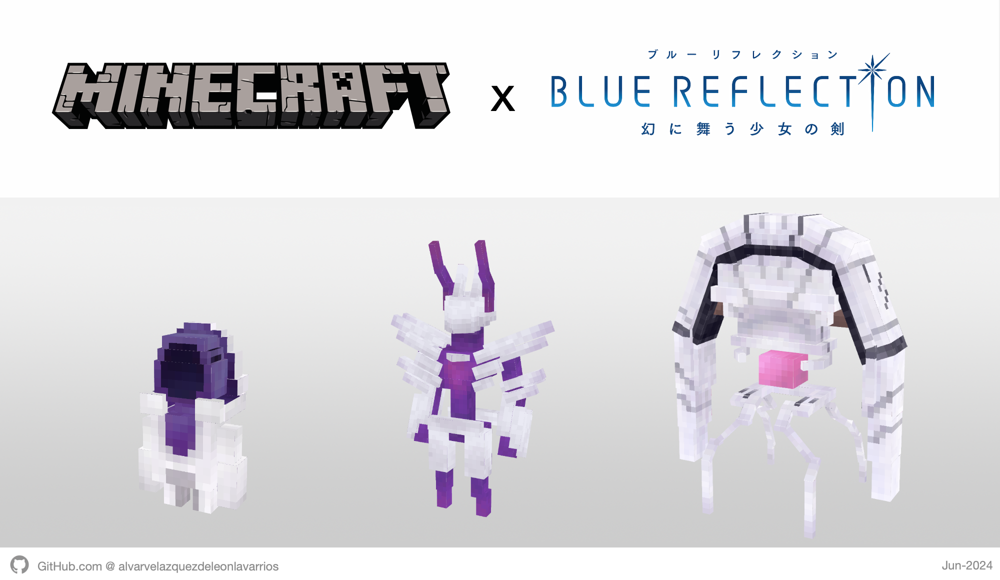
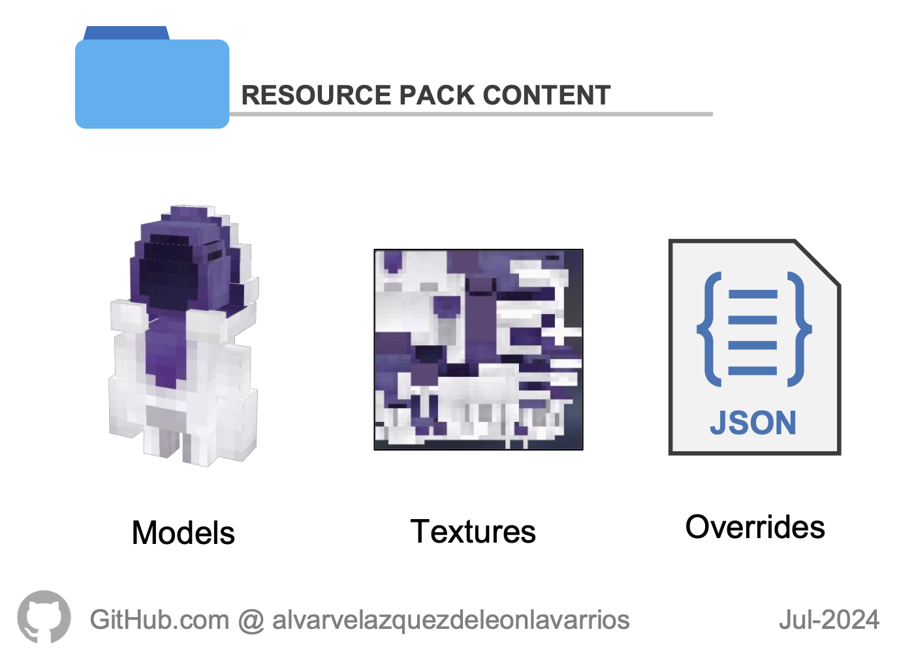
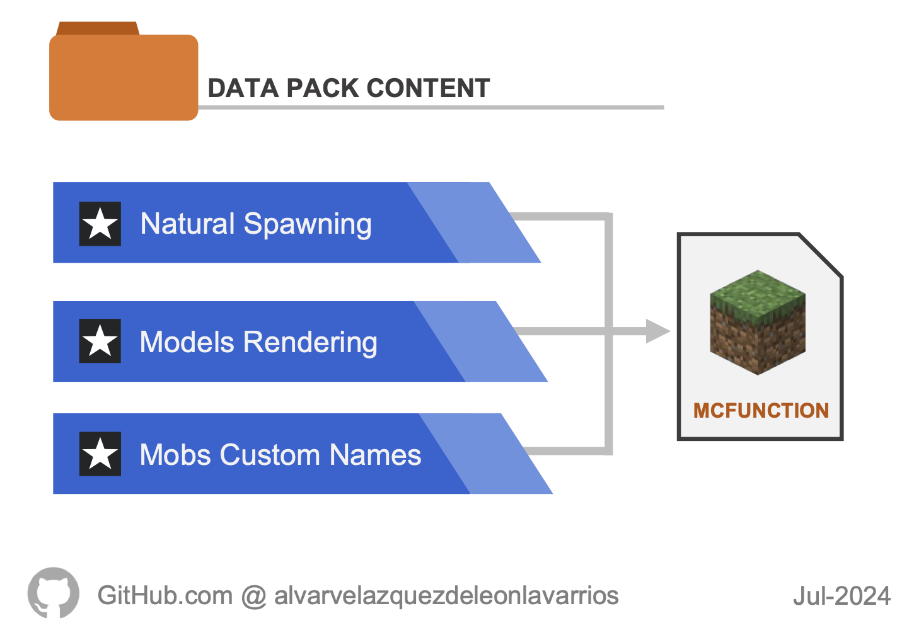

# Blue Reflection Minecraft Demons

Welcome! This is an **Unofficial/Fan made** project about the magical girls JRPG franchise **Blue Reflection**.

## Content

The project contains both **Resource Pack** and **Data Pack** with the most well-known NPC enemies of the franchise, allowing players to visualize them in-game.

### Resource Pack

3D models and textures of the main demons of the franchise.

Features:
- 3D Models in JSON files
- Textures in PNG files
- Overrides for a default Minecraft item (Nether Brick) to render the custom models

### Data Pack

Functions that allow render every demon into the game and make them walk around the world.

> [!NOTE]
> The data pack's purpose is to serve as a **template** so that other players/developers can customize the demons adding their own features.

Features:
- Natural random spawning (replaces all hostile ground mobs)
- Constant synchronization between the base mob (Vindicator) and its armor stand (3D model)
- Death detection system (clears 3D model rendering)
- Mobs custom names (always invisible)
- Mobs deal a minimum amount of damage to players

## Demons List

The demon characters included within the project come from the following game titles:

- [Blue Reflection](/src/BlueReflection.md)
- [Blue Reflection Tie](/src/BlueReflectionTie.md)

## Manual

For further information about downloading and installing both Data and Resource packs, read the [Online Manual](/MANUAL.md).

There are also two Offline Manual versions (light and dark) in the **Assets** section of each release.

## Disclaimer

The Blue Reflection brand belongs to Koei Tecmo Holdings Co., Ltd. and Gust Co. Ltd. All another rights reserved by their respective owners.

For terms of use of this project, read its [License](/LICENSE).
